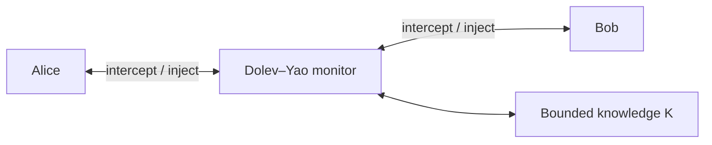

# mCRL2DY

[](https://github.com/IMTAltiStudiLucca/mCRL2DY/actions/workflows/ci.yml)

**mCRL2DY** is a demonstrator of a bounded Dolev–Yao attacker modelled as a
monitor that executes in parallel with the honest participants of a security
protocol.

The project uses [mCRL2](https://www.mcrl2.org/) to describe the protocol,
attacker knowledge, network interception, symbolic term derivation, and
security goals in a single process-algebraic model. The included example is
the Needham–Schroeder Public-Key protocol (NSPK) and its classic Lowe attack.

## Core idea

Rather than encoding one predefined attack trace, the attacker is represented
as an independent recursive process:

```text
DY(goal, knowledge) =
    report success if the goal is known
  + inject a known term
  + intercept and learn a term
  + derive a new term
```

The DY process runs concurrently with Alice and Bob. All protocol traffic is
forced to synchronise with the monitor, so the attacker mediates every network
operation:



The honest processes never communicate directly. An outgoing message
synchronises with `dy_sup`, allowing DY to intercept and store it. A message
selected from attacker knowledge synchronises through `dy_ins` with an honest
receive action.

## Attacker behaviour

At each iteration, the monitor nondeterministically chooses one of four
operations:

1. **Win** — emit `intruder_wins(goal)` when the goal belongs to its knowledge.
2. **Inject** — select a known term and offer it to an honest participant.
3. **Intercept** — receive a network term and add it to its knowledge.
4. **Derive** — apply one constructor or destructor rule to known terms.

The NSPK attacker supports:

- pairing of terms in protocol-relevant forms;
- public-key encryption;
- projection of pair components;
- decryption when the matching private key is known;
- interception, replay, redirection, and synthesis of messages.

Nondeterministic selection is represented with the mCRL2 `sum` operator. DY
knowledge is stored as an `FSet(Msg)`, giving a canonical set representation:
duplicates and insertion order do not create distinct knowledge states.

## Bounded analysis

An unrestricted symbolic attacker can generate infinitely many nested terms.
For example, pairing and encryption can be applied repeatedly without reaching
a fixed point. The demonstrator therefore bounds:

- the number of distinct terms in attacker knowledge;
- the maximum depth of generated terms;
- the shapes of constructed messages to those relevant to NSPK.

The default example uses a maximum knowledge cardinality of `16` and a maximum
term depth of `2`. These values are sufficient for the intended Lowe-attack
experiment while keeping exploration manageable.

This is an **under-approximation** of an unbounded Dolev–Yao attacker. A found
attack is a valid witness in the model, but failure to find one proves only
that no attack exists within the selected bounds and modelling assumptions.

## Repository layout

```text
mCRL2DY/
├── Makefile
├── README.md
├── intruder.mcrl2
├── example/
│   └── alice_bob.mcrl2
└── goal/
    ├── attack_reachable.mcf
    ├── authentication_violation.mcf
    └── nonce_leak_reachable.mcf
```

The build combines the honest protocol and attacker fragments into a complete
mCRL2 specification before linearisation. Generated files and traces are
written under `build/`.

## Requirements

- the [mCRL2 toolset](https://www.mcrl2.org/web/user_manual/download.html);
- GNU Make;
- GNU m4;
- Graphviz, optionally, for rendering traces exported as DOT.

The following commands should be available on `PATH`:

```bash
m4 --version
mcrl22lps --version
lps2pbes --version
pbes2bool --version
lps2lts --version
tracepp --version
```

On Ubuntu, Make, m4, and Graphviz can be installed with:

```bash
sudo apt install make m4 graphviz
```

Install mCRL2 using a package or binary supplied by the mCRL2 project.

## Make targets

Run the built-in help to see all available targets and configuration
variables:

```bash
make help
```

The main targets are:

| Target | Purpose |
| --- | --- |
| `make model` | Generate the combined mCRL2 specification. |
| `make build` | Generate and linearise the model. |
| `make verify` | Verify the default modal property through a PBES. |
| `make verify-all` | Verify all formulas under `goal/`. |
| `make attack-trace` | Search for a concrete trace leading to `intruder_wins`. |
| `make show-attack` | Print the generated attack trace in plain text. |
| `make clean-attack-traces` | Remove generated attack traces. |
| `make clean` | Remove generated build artefacts. |

Verbose convenience targets are also available:

```bash
make build-verbose
make verify-verbose
make attack-trace-verbose
```

## Build the model

Generate only the combined specification:

```bash
make model
```

Generate and linearise the complete model:

```bash
make build
```

The resulting linear process is:

```text
build/dy_model.lps
```

To rebuild everything from scratch:

```bash
make clean
make build
```

## Verify the security goals

Verify the default property:

```bash
make verify
```

Verify every formula under `goal/`:

```bash
make verify-all
```

Enable progress messages using either form:

```bash
make verify VERBOSE=1
make verify-verbose
```

More detailed logging and timing information can be requested with:

```bash
make verify LOG_LEVEL=debug TIMINGS=1
```

The final `true` or `false` printed by `pbes2bool` is the truth value of the
formula, not an execution status. Its interpretation depends on how the
corresponding `.mcf` property is written. For example:

- an existential reachability formula returning `true` means that a witness
  exists;
- a safety invariant returning `false` means that the invariant is violated;
- an existential violation formula returning `false` means that the requested
  violation was not found in the bounded model.

The name of an `.mcf` file does not determine the meaning of the Boolean
result; always inspect the formula itself.

## Search for an attack trace

To search the LPS for the default victory action and save one shortest witness:

```bash
make attack-trace
```

The target invokes `lps2lts` with breadth-first exploration, caching, a state
limit, `--action=intruder_wins`, and `--trace=1`. It also checks that a `.trc`
file was actually created; reaching the state limit without a trace therefore
causes the target to fail.

Enable progress messages with:

```bash
make attack-trace-verbose
```

The action and exploration bound can be overridden from the command line:

```bash
make attack-trace ATTACK_ACTION=bob_commit
make attack-trace ATTACK_MAX_STATES=1000000
make attack-trace-verbose ATTACK_ACTION=bob_commit ATTACK_MAX_STATES=1000000
```

Print the generated witness in human-readable form:

```bash
make show-attack
```

With the default settings, the trace has a name similar to:

```text
build/dy_model.lps_act_0_intruder_wins.trc
```

Remove only generated attack traces with:

```bash
make clean-attack-traces
```

## Interactive inspection

Open the linear process in the graphical simulator:

```bash
lpsxsim build/dy_model.lps
```

A generated `.trc` file can be loaded from the simulator and traversed step by
step. The complete graphical toolchain can also be opened with:

```bash
mcrl2-gui
```

To inspect a trace directly without using the Makefile:

```bash
tracepp --format=plain build/dy_model.lps_act_0_intruder_wins.trc
```

## Interpreting exploration results

The distinction between verification and trace search is important:

- `pbes2bool` evaluates a modal formula and prints its Boolean truth value;
- `lps2lts --action=... --trace=1` searches for a concrete occurrence of an
  action and stops after producing the requested witness;
- reaching `--max` without producing a trace is inconclusive, because only a
  prefix of the state space was explored;
- completing exhaustive exploration without finding the requested action
  establishes unreachability only for the bounded model.

## Validating the Lowe attack trace

The default witness can be printed with:

```bash
make show-attack
```

A successful nonce-secrecy witness ends with:

```text
intruder_wins(nonce(nb))
```

This action is enabled only when `nonce(nb)` belongs to the Dolev–Yao
knowledge set. Its occurrence therefore confirms that the attacker derived
Bob's fresh nonce within the configured knowledge and term-depth bounds.

An example generated witness is:

```text
intercepted(channel_a, enc(pair(nonce(na), agent(alice)), pub(intruder)))
derive(enc(nonce(ni), pub(alice)))
derive(enc(nonce(ni), pub(bob)))
derive(pair(nonce(na), agent(alice)))
derive(enc(pair(nonce(na), agent(alice)), pub(bob)))
delivered(channel_b, enc(pair(nonce(na), agent(alice)), pub(bob)))
intercepted(channel_b, enc(pair(nonce(na), nonce(nb)), pub(alice)))
delivered(channel_a, enc(pair(nonce(na), nonce(nb)), pub(alice)))
alice_commit(alice, intruder, nb)
intercepted(channel_a, enc(nonce(nb), pub(intruder)))
derive(nonce(nb))
intruder_wins(nonce(nb))
```

The security-relevant events correspond to the Lowe attack as follows:

| Trace event | Lowe attack step | Interpretation |
| --- | --- | --- |
| `intercepted(channel_a, enc(pair(nonce(na), agent(alice)), pub(intruder)))` | $A \rightarrow I : \{N_A,A\}_{K_I}$ | Alice starts a legitimate session with the intruder, which can decrypt the message. |
| `derive(pair(nonce(na), agent(alice)))` | Intruder deduction | The intruder uses its private key to recover $N_A$ and Alice's identity. |
| `derive(enc(pair(nonce(na), agent(alice)), pub(bob)))` | $I(A) \rightarrow B : \{N_A,A\}_{K_B}$ | The intruder re-encrypts the plaintext for Bob while impersonating Alice. |
| `delivered(channel_b, ...)` | Delivery to Bob | Bob receives a correctly shaped first NSPK message and believes Alice initiated the session. |
| `intercepted(channel_b, enc(pair(nonce(na), nonce(nb)), pub(alice)))` | $B \rightarrow I(A) : \{N_A,N_B\}_{K_A}$ | Bob creates $N_B$. The intruder cannot decrypt the response, but can forward it unchanged. |
| `delivered(channel_a, enc(pair(nonce(na), nonce(nb)), pub(alice)))` | $I \rightarrow A : \{N_A,N_B\}_{K_A}$ | The intruder forwards Bob's challenge into Alice's original session. |
| `alice_commit(alice, intruder, nb)` | Alice accepts | Alice recognises $N_A$, accepts $N_B$, and still believes her peer is the intruder. |
| `intercepted(channel_a, enc(nonce(nb), pub(intruder)))` | $A \rightarrow I : \{N_B\}_{K_I}$ | Alice returns Bob's nonce encrypted for the peer she believes she is using. |
| `derive(nonce(nb))` | Intruder deduction | The intruder decrypts the message with its private key and learns Bob's nonce. |
| `intruder_wins(nonce(nb))` | Secrecy violation | The configured goal is now in attacker knowledge. |

The deductions involving `nonce(ni)` are valid but irrelevant choices made by
the nondeterministic attacker. They do not contribute to the successful path.

### Completing the authentication attack

The classical Lowe authentication attack continues with:

```text
derive(enc(nonce(nb), pub(bob)))
delivered(channel_b, enc(nonce(nb), pub(bob)))
bob_commit(bob, alice, nb)
```

This corresponds to:

$$
I(A) \rightarrow B : \{N_B\}_{K_B}.
$$

If the current DY process terminates immediately after
`intruder_wins(nonce(nb))`, the generated witness proves nonce disclosure but
cannot reach Bob's final authentication event. To search for the complete
authentication violation, DY must report success once and then continue its
other transitions. A Boolean process parameter such as `won` can prevent the
victory action from being emitted repeatedly:

```text
if !won and goal is known:
    emit intruder_wins(goal)
    continue with won = true
```

The remaining inject, intercept, and derive branches continue while preserving
the current value of `won`. The complete path can then be searched with:

```bash
make attack-trace ATTACK_ACTION=bob_commit
```

A full authentication witness ends with:

```text
bob_commit(bob, alice, nb)
```

while the related Alice event is:

```text
alice_commit(alice, intruder, nb)
```

The mismatch captures the authentication failure: Bob completes believing
Alice is his peer, whereas Alice completed the related session believing she
was communicating with the intruder.

## Continuous integration

The GitHub Actions workflow in `.github/workflows/ci.yml` can invoke the same
Make targets used locally. A lightweight CI should run `make build` on every
push. Expensive PBES verification or attack searches can be placed in separate
jobs with explicit time and state limits.

The badge at the top of this document reports the most recent completed CI run
for the relevant branch. A self-hosted workflow requires an online runner with
mCRL2 and the other dependencies already installed.

## Scope and limitations

mCRL2DY is a research and teaching demonstrator, not a production protocol
verification framework. In particular:

- the example models one Alice session and one Bob session;
- cryptography is perfect and symbolic, following the Dolev–Yao abstraction;
- attacker knowledge and term depth are bounded;
- the well-typed attacker generates only protocol-relevant NSPK terms;
- freshness, session replication, compromised principals, and additional
  cryptographic primitives require explicit modelling;
- results apply to the formal model, not automatically to an implementation.

The structure is intentionally modular: other honest protocols can replace the
contents of `example/`, while the attacker process can be extended with the
corresponding constructors, destructors, initial knowledge, channels, and
security goals.
