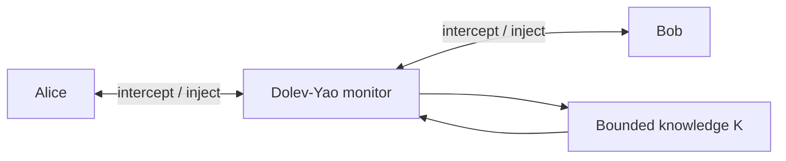

# mCRL2DY

**mCRL2DY** is a demonstrator of a bounded Dolev-Yao attacker modelled as a
monitor that executes in parallel with the honest participants of a security
protocol.

The project uses [mCRL2](https://www.mcrl2.org/) to describe the protocol,
attacker knowledge, network interception, symbolic term derivation, and
security goals in a single process-algebraic model. The included example is
the Needham-Schroeder Public-Key protocol (NSPK) and its classic Lowe attack.

## Core idea

Rather than encoding one predefined attack trace, the attacker is represented
as an independent recursive process:

```text
DY(goal, knowledge) =
    win if goal is known
  + inject a known term
  + intercept and learn a term
  + derive a new term
```

The DY process runs concurrently with Alice and Bob. All protocol traffic is
forced to synchronise with the monitor, so the attacker mediates every network
operation:



The honest processes never communicate directly. An outgoing message
synchronises with `dy_sup`, allowing DY to intercept and store it. A message
selected from attacker knowledge synchronises through `dy_ins` with an honest
receive action.

## Attacker behaviour

At each iteration, the monitor nondeterministically chooses one of four
operations:

1. **Win** - emit `intruder_wins(goal)` when the goal belongs to its knowledge.
2. **Inject** - select a known term and offer it to an honest participant.
3. **Intercept** - receive a network term and add it to its knowledge.
4. **Derive** - apply one constructor or destructor rule to known terms.

The NSPK attacker supports:

- pairing of terms in protocol-relevant forms;
- public-key encryption;
- projection of pair components;
- decryption when the matching private key is known;
- interception, replay, redirection, and synthesis of messages.

Nondeterministic selection is represented with the mCRL2 `sum` operator. DY
knowledge is stored as an `FSet(Msg)`, giving a canonical set representation:
duplicates and insertion order do not create semantically equivalent states.

## Bounded analysis

An unrestricted symbolic attacker can generate infinitely many nested terms.
For example, pairing and encryption can be applied repeatedly without reaching
a fixed point. The demonstrator therefore bounds:

- the number of distinct terms in attacker knowledge;
- the maximum depth of generated terms;
- the shapes of constructed messages to those relevant to NSPK.

The default example uses a maximum knowledge cardinality of `16` and a maximum
term depth of `2`. These values are sufficient for the intended Lowe-attack
experiment while keeping exploration more manageable.

This is an **under-approximation** of an unbounded Dolev-Yao attacker. A found
attack is a valid witness in the model, but failure to find one proves only
that no attack exists within the selected bounds and modelling assumptions.

## Repository layout

```text
mCRL2DY/
- Makefile
- README.md
- intruder.mcrl2
- example/
  - alice_bob.mcrl2
- goal/
  - attack_reachable.mcf
  - authentication_violation.mcf
  - nonce_leak_reachable.mcf
```

The build combines the honest protocol and attacker fragments into one complete
mCRL2 specification before linearisation.

## Requirements

- the [mCRL2 toolset](https://www.mcrl2.org/web/user_manual/download.html);
- GNU Make;
- GNU m4;
- Graphviz, optionally, for rendering traces exported as DOT.

The following mCRL2 commands should be available on `PATH`:

```bash
mcrl22lps --version
lps2pbes --version
pbes2bool --version
lps2lts --version
tracepp --version
```

On Ubuntu, Make, m4, and Graphviz can be installed with:

```bash
sudo apt install make m4 graphviz
```

Install mCRL2 using the packages or binaries provided by the mCRL2 project.

## Build the model

Generate the combined specification:

```bash
make model
```

Linearise it:

```bash
make build
```

Generated files are written under `build/`.

To rebuild everything from scratch:

```bash
make clean
make build
```

## Verify the security goals

Verify the main authentication property:

```bash
make verify
```

Verify all formulas under `goal/`:

```bash
make verify-all
```

Enable progress messages:

```bash
make verify VERBOSE=1
```

or use the convenience target:

```bash
make verify-verbose
```

More detailed logging and timing information can be requested with:

```bash
make verify LOG_LEVEL=debug TIMINGS=1
```

For the vulnerable NSPK configuration, the reachability goals are intended to
show that DY can learn `nonce(nb)` and emit:

```mcrl2
intruder_wins(nonce(nb))
```

## Search for an attack trace

For an existential reachability goal, directly search the LPS for the victory
action:

```bash
lps2lts \
  --verbose \
  --strategy=breadth \
  --action=intruder_wins \
  --trace=1 \
  --max=500000 \
  --cached \
  --rewriter=jittyc \
  build/nspk_lowe.lps \
  build/attack-search.lts
```

If `jittyc` is unavailable, replace it with `jitty`.

When the requested action is reached, `lps2lts` writes a `.trc` witness. Find
generated traces with:

```bash
find . -type f -name '*.trc' -print
```

Print a trace in human-readable form:

```bash
tracepp --format=plain path/to/attack.trc
```

Include state vectors when available:

```bash
tracepp --format=states path/to/attack.trc
```

Export the trace as a graph:

```bash
tracepp --format=dot path/to/attack.trc build/attack-trace.dot
dot -Tpdf build/attack-trace.dot -o build/attack-trace.pdf
```

## Interactive inspection

Open the linear process in the graphical simulator:

```bash
lpsxsim build/nspk_lowe.lps
```

A generated `.trc` file can then be loaded from the simulator interface and
traversed step by step. The complete toolchain can also be accessed through:

```bash
mcrl2-gui
```

## Interpreting results

The relevant distinction is:

- **`true` or a generated witness:** the corresponding attack is reachable
  under the current model and bounds;
- **`false` after complete exploration:** the property is unreachable under
  the current model and bounds;
- **resource limit reached:** the result is inconclusive because only part of
  the state space was explored.

Reaching `--max` in `lps2lts` without producing a `.trc` does not prove that the
attack is absent.

## Scope and limitations

mCRL2DY is a research and teaching demonstrator, not a production protocol
verification framework. In particular:

- the example models one Alice session and one Bob session;
- cryptography is perfect and symbolic, following the Dolev-Yao abstraction;
- attacker knowledge and term depth are bounded;
- the well-typed attacker generates only protocol-relevant NSPK terms;
- freshness, session replication, compromised principals, and additional
  cryptographic primitives require explicit modelling;
- results apply to the formal model, not automatically to an implementation.

The structure is intentionally modular: other honest protocols can replace the
contents of `example/`, while the attacker process can be extended with the
corresponding constructors, destructors, initial knowledge, channels, and
security goal.